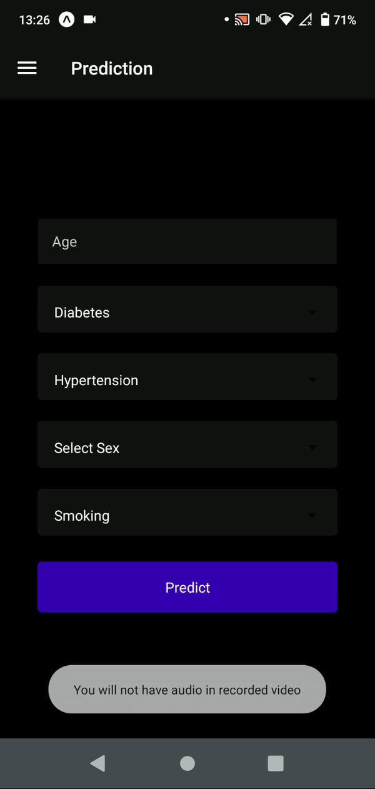

# Heart Failure Predictor

This is a mobile application developed with React Native and Expo, designed to run on real devices.

## Installation

Follow these steps to install and run the application on your device:

1. Clone this repository: git clone https://github.com/yourusername/MyApplication.git
2. Navigate to the project directory: cd heart-failure-predictor-ts
3. Install the dependencies: npm install
4. Run the application: npx expo start

Note: Make sure you have Expo CLI installed on your computer and Expo Go on your mobile device to run the app.
To install Expo CLI and Expo Go visit: https://docs.expo.dev/get-started/installation/

## Screenshots

